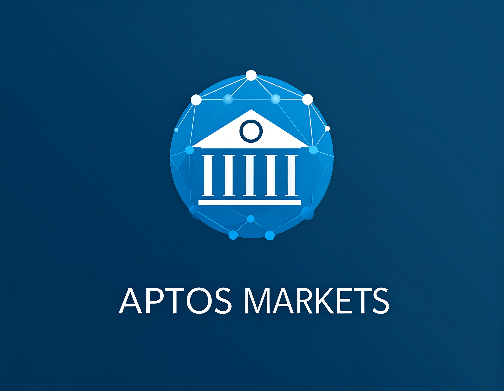
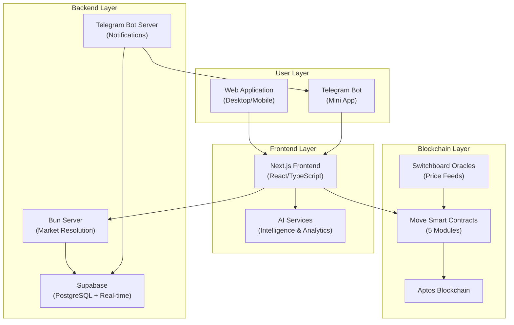
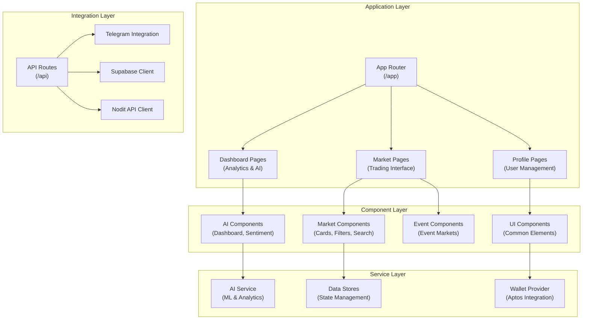
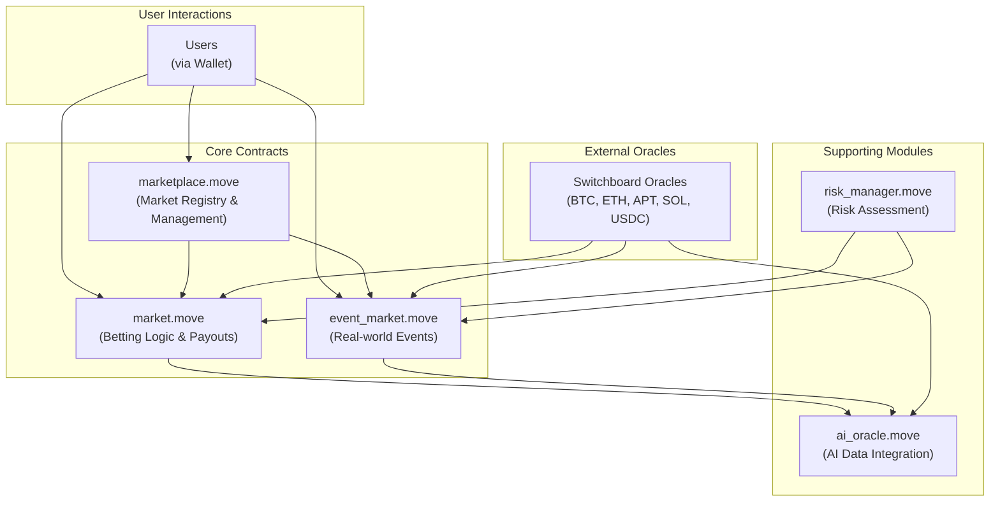
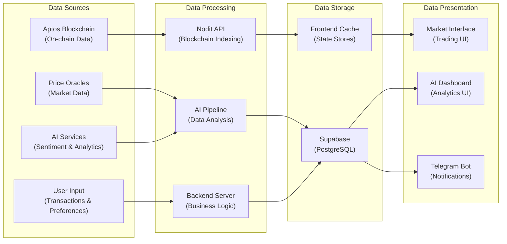

<div align="center" style="background: linear-gradient(135deg, #0ea5e9 0%, #0369a1 100%);">
  
</div>

## Aptos Markets

Aptos Markets is a next-generation AI-powered decentralized prediction market platform built on the Aptos blockchain. Designed as both a web application and Telegram app for maximum accessibility, it allows participants to predict future asset prices and real-world events while leveraging advanced AI for market intelligence, sentiment analysis, and personalized recommendations.

## Table of Contents

- [Introduction](#introduction)
- [Key Features](#key-features)
- [AI-Powered Features](#ai-powered-features)
- [Project Information](#project-information)
- [Tech Stack](#tech-stack)
- [Architecture Overview](#architecture-overview)
- [Installation and Setup](#installation-and-setup)
- [API Documentation](#api-documentation)
- [Vision and Roadmap](#vision-and-roadmap)
- [Team](#team)

## Introduction

Aptos Markets revolutionizes decentralized finance by combining traditional prediction markets with cutting-edge artificial intelligence. Users can create their own markets, predict future asset prices, and forecast real-world events while receiving AI-driven insights, sentiment analysis, and personalized recommendations. Our platform makes sophisticated market analysis accessible to everyone through an intuitive interface optimized for both web and Telegram.

## Key Features

### Core Platform Features
- AI-Powered Market Intelligence: Advanced analytics and insights for informed decision-making
- Real-time Sentiment Analysis: Multi-source sentiment tracking with trending indicators
- Personalized Recommendations: AI-driven market suggestions based on user behavior and risk profile
- Decentralized Prediction Markets: Create and participate in markets for asset prices and real-world events
- Telegram Bot Integration: Full platform access directly within Telegram
- Advanced Dashboard: Comprehensive statistics and performance tracking
- Multi-Asset Support: BTC, ETH, APT, SOL, USDC prediction markets

### Technical Features
- Trustless Price Feeds: Switchboard oracles for reliable on-chain price data
- Automated Market Resolution: Backend server ensures timely and accurate market closure
- Real-time Updates: Live market data with WebSocket connections
- Mobile-Optimized: Responsive design for all devices
- Wallet Integration: Seamless Aptos wallet connectivity

## AI-Powered Features

### 🧠 Market Intelligence
- Predictive Analytics: AI models analyze market trends and provide forecasts
- Risk Assessment: Automated risk scoring for markets and user portfolios
- Market Maker AI: Dynamic pricing algorithms for optimal liquidity

### 📊 Sentiment Analysis
- Multi-Source Aggregation: News, social media, and market data analysis
- Real-time Monitoring: Live sentiment tracking with historical trends
- Sentiment Scoring: Bullish/bearish indicators with confidence levels

### 🎯 Personalized Experience
- Smart Recommendations: AI suggests markets based on user preferences and expertise
- Risk Profiling: Automatic user risk assessment and tailored suggestions
- Performance Optimization: AI-driven portfolio analysis and improvement suggestions

### 🤖 AI Assistant
- Interactive Chat: AI-powered assistant for platform guidance and market insights
- Natural Language Queries: Ask questions about markets, trends, and predictions
- Educational Content: AI-generated explanations and learning materials

### 🔍 Fraud Detection
- Anomaly Detection: AI monitors for suspicious trading patterns
- Market Integrity: Automated analysis to ensure fair market conditions
- Risk Mitigation: Proactive identification of potential issues

## Project Information

Aptos Markets represents the evolution of prediction markets, originally developed for the Aptos Code Collision Hackathon and now enhanced with world-class AI capabilities. The platform has been completely rebranded and expanded with production-ready AI services, making it the most advanced prediction market platform on Aptos.

- Development: Continuous development since hackathon
- Commits: 150+ commits with major AI integration
- Lines of Code: 15,000+ lines including AI services
- AI Integration: Comprehensive AI service layer with real data sources

## Tech Stack

Aptos Markets leverages a cutting-edge technology stack designed for scalability, performance, and AI integration:

### Frontend & Design
- Next.js 14: App Router with server components and streaming
- TypeScript: Full type safety across the entire codebase
- Tailwind CSS: Utility-first styling with custom design system
- Framer Motion: Smooth animations and interactions
- Radix UI: Accessible component primitives

### Blockchain & Web3
- Aptos Move: Smart contracts for decentralized market logic
- Petra Wallet: Primary wallet integration
- Switchboard Oracles: Decentralized price feed infrastructure
- Nodit API: Aptos blockchain data indexing

### AI & Data Services
- Custom AI Service Layer: Proprietary AI algorithms for market analysis
- Multi-Source Data Integration: Real-time sentiment and market data
- Machine Learning Pipeline: Predictive models and risk assessment
- Natural Language Processing: AI chat assistant and content analysis

### Backend & Infrastructure
- Bun: High-performance JavaScript runtime
- Supabase: PostgreSQL database with real-time subscriptions
- Telegram Bot API: Native Telegram integration
- Real-time WebSockets: Live data updates

### Development & Deployment
- pnpm: Fast, disk space efficient package manager
- ESLint & Prettier: Code quality and formatting
- Vercel: Deployment and hosting platform
- GitHub Actions: CI/CD pipeline

## Architecture Overview

Aptos Markets consists of four fundamental components working together:

### 1. Smart Contract Layer (Aptos Move)

The foundation of our platform built on Aptos Move:

- Marketplace Module: Manages all markets for specific assets (APT, BTC, ETH, SOL, USDC)
- Market Module: Handles betting interactions, asset transfers, and reward distribution
- Event Market Module: Specialized module for real-world event predictions
- Oracle Integration: Switchboard oracles ensure trustless and decentralized market resolution
- Security: Comprehensive testing and formal verification

### 2. AI Service Layer

Our proprietary AI engine powering intelligent features:

- Market Intelligence Engine: Predictive analytics and trend analysis
- Sentiment Analysis Pipeline: Multi-source sentiment aggregation and processing
- Recommendation System: Personalized market suggestions and risk assessment
- Fraud Detection: Anomaly detection and market integrity monitoring
- Chat Assistant: Natural language processing for user interactions

### 3. Frontend Application (Next.js)

Modern web application optimized for performance and user experience:

- Responsive Design: Mobile-first approach with desktop optimization
- Real-time Updates: WebSocket connections for live data
- AI Dashboard: Comprehensive AI insights and analytics interface
- Wallet Integration: Seamless Aptos wallet connectivity
- Telegram Optimization: Progressive Web App features for Telegram

### 4. Backend Services

Robust server infrastructure ensuring platform reliability:

- Market Resolution Service: Automated market closure and reward distribution
- AI Processing Pipeline: Background AI analysis and data processing
- Telegram Bot Server: Native Telegram app functionality
- Notification System: Real-time alerts and updates
- Data Synchronization: Blockchain and database state management

### Architecture Overview

The Aptos Markets platform consists of multiple interconnected layers, each designed for specific functionality. Below are the architectural diagrams broken down by system components:

#### 1. System Overview
High-level view of the entire platform architecture:



#### 2. Frontend Architecture
Detailed view of the Next.js frontend structure:



#### 3. Smart Contract Architecture
Move contracts and their relationships on Aptos blockchain:



#### 4. Data Flow Architecture
How data flows through the system from sources to presentation:



## Installation and Setup

### Prerequisites
- Node.js 18+ and pnpm
- Bun runtime for server components
- Aptos CLI for Move contract deployment
- Git for version control

### Local Development Setup

1. Clone the repository:
   ```bash
   git clone https://github.com/kamalbuilds/aptos-markets.git
   cd aptos-markets
   ```

2. Install dependencies:
   ```bash
   bun install
   ```

3. Environment Configuration:
   ```bash
   cp .env.example .env.local
   # Configure your environment variables
   ```

4. Deploy Move contracts:
   ```bash
   bunx run move:publish
   bunx run move:types
   ```

5. Start the development server:
   ```bash
   pnpm run dev
   ```

6. Launch the backend server:
   ```bash
   cd ./server
   pnpm install
   pnpm run dev
   ```

7. Access the application:
   - Web App: `http://localhost:3000`
   - AI Dashboard: `http://localhost:3000/dashboard`

### Production Deployment

```bash
# Build the application
pnpm run build

# Start production server
pnpm start

# Deploy server components
cd ./server && pnpm run start
```

## API Documentation

### AI Services API

#### GET /api/ai/insights
Get AI-powered market insights and analytics.

Parameters:
- `market_address` (optional): Specific market analysis
- `timeframe` (optional): Analysis timeframe (1h, 24h, 7d, 30d)

Response:
```json
{
  "insights": [
    {
      "type": "trend_analysis",
      "confidence": 0.85,
      "prediction": "bullish",
      "timeframe": "24h",
      "factors": ["sentiment", "volume", "technical"]
    }
  ],
  "summary": "Market shows strong bullish signals...",
  "timestamp": "2024-01-01T00:00:00Z"
}
```

#### POST /api/ai/recommendations
Get personalized market recommendations.

Request Body:
```json
{
  "user_address": "0x...",
  "risk_tolerance": "medium",
  "preferences": ["crypto", "sports"]
}
```

#### GET /api/ai/sentiment
Real-time sentiment analysis for markets.

Response:
```json
{
  "overall_sentiment": 0.65,
  "sources": {
    "news": 0.7,
    "social": 0.6,
    "market": 0.65
  },
  "trending": ["bitcoin", "ethereum"],
  "last_updated": "2024-01-01T00:00:00Z"
}
```

### Market API

#### GET /api/market/price-percentage
Get price percentage changes for assets.

#### POST /api/market/revalidate/[address]
Trigger market data revalidation.

### Telegram API

#### POST /api/telegram/auth
Handle Telegram user authentication.

#### POST /api/telegram/notify
Send notifications to Telegram users.

## Vision and Roadmap

Aptos Markets aims to be the leading AI-powered prediction market platform, setting new standards for intelligent DeFi applications. Our roadmap focuses on expanding AI capabilities, global adoption, and ecosystem growth.

### Phase 1 - AI Foundation Complete ✅
- ✅ Core AI service layer implementation
- ✅ Sentiment analysis integration
- ✅ Personalized recommendation engine
- ✅ AI-powered dashboard and insights
- ✅ Risk assessment and fraud detection

### Phase 2 - Advanced AI Features (Q2 2025)
- Machine Learning Models: Advanced predictive algorithms
- Natural Language Processing: Enhanced chat assistant
- Computer Vision: Chart and pattern recognition
- Automated Trading: AI-powered market making strategies

### Phase 3 - Mainnet Launch & Scaling (Q3 2025)
- Mainnet Deployment: Full production launch on Aptos
- Security Audits: Comprehensive smart contract auditing
- Performance Optimization: Sub-second response times
- Mobile Apps: Native iOS and Android applications

### Phase 4 - Ecosystem Expansion (Q4 2025)
- Multi-Chain Support: Cross-chain prediction markets
- DeFi Integrations: Yield farming and liquidity mining
- Partnership Program: Integration with major DeFi protocols
- Developer SDK: Tools for third-party developers

### Phase 5 - Global Adoption (Q5 2025)
- Institutional Features: Enterprise-grade trading tools
- Regulatory Compliance: Legal framework adaptation
- International Expansion: Multi-language support
- Educational Platform: Comprehensive learning resources

## Team

Aptos Markets is built by a world-class team combining deep blockchain expertise with cutting-edge AI experience:

Our team's combined expertise in blockchain technology, artificial intelligence, and user experience design makes us uniquely positioned to build the future of intelligent prediction markets.

---

## Contributing

We welcome contributions from the community! Please read our contributing guidelines and join our developer community.

---

<div align="center" style="background: linear-gradient(135deg, #0ea5e9 0%, #0369a1 100%);">
  <h3 style="color: white; padding: 20px;">The Future of AI-Powered Prediction Markets</h3>
</div>

